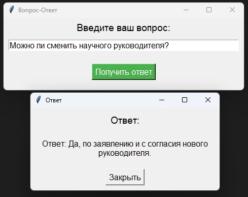
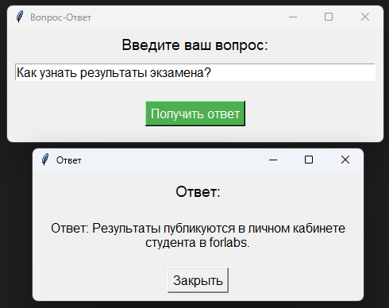
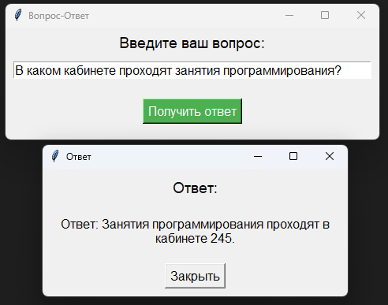
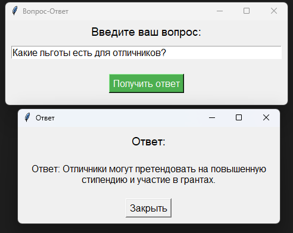
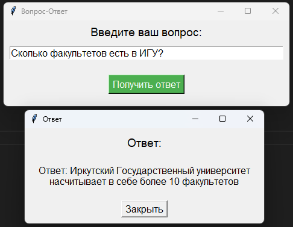

# Проект FAQ

## Описание проекта
Этот проект представляет собой чат-бота для ответов на вопросы, касающиеся жизни университета, факультета или кафедры. Бот использует модель на основе TensorFlow для обработки и предсказания ответов на вопросы, используя предобученную модель BERT (DeepPavlov/rubert-base-cased). Проект позволяет работать оффлайн, а также предоставляет удобный графический интерфейс для взаимодействия с пользователем с помощью библиотеки Tkinter.

## Структура проекта
Проект состоит из нескольких файлов:

- **main.py**: Главный файл, который реализует пользовательский интерфейс на Tkinter. Он позволяет вводить вопрос и получать ответ с помощью предварительно обученной модели.
- **ENV_VARS.py**: Конфигурационный файл, в котором указаны переменные окружения, такие как название модели, путь к модели и путь к данным.
- **preprocess_text.py**: Файл с функцией для предобработки текста с помощью модели BERT.
- **model.py**: Файл для обучения модели на основе текстовых данных (вопрос-ответ) с использованием TensorFlow.
- **data.py**: Файл с исходными данными (FAQ) для обучения модели и их сохранения в формате JSON.
- **data.json**: Данные для обучения модели в формате JSON.

## Установка
Для использования проекта необходимо установить все зависимости:

```bash
pip install -r requirements.txt
```

## Запуск
Для запуска проекта необходимо запустить файл **main.py**:
```bash
python main.py
```

## Использование
1. Введите вопрос в поле ввода и нажмите "Получить ответ".
2. Бот обработает ваш вопрос с помощью модели и отобразит соответствующий ответ в новом окне.

## Структура данных для обучения модели
```json
[
    {"question":"question_text", "answer":"answer_text"},
    {"question":"question_text", "answer":"answer_text"},
    ...
]
```
## Демонстрация










<video width="640" height="480" controls>
  <source src="demonstration/demonstration.mp4" type="video/mp4">
</video>